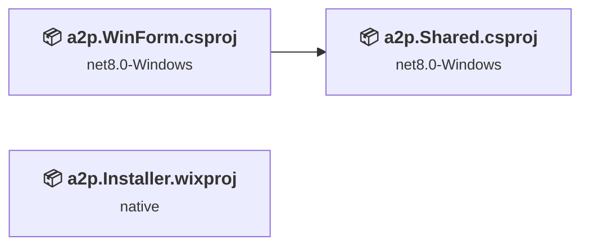
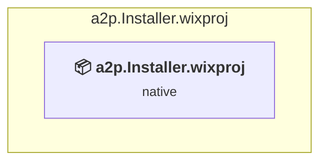
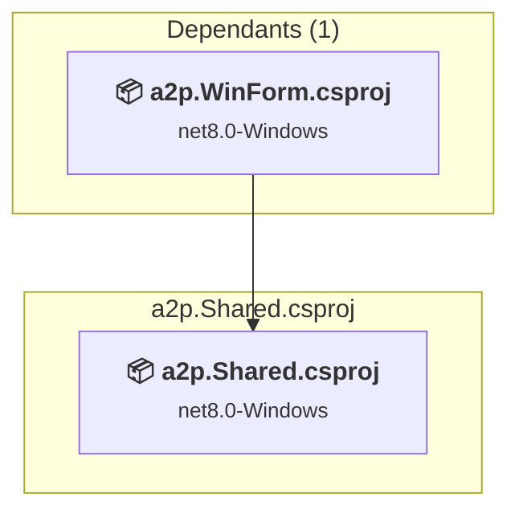
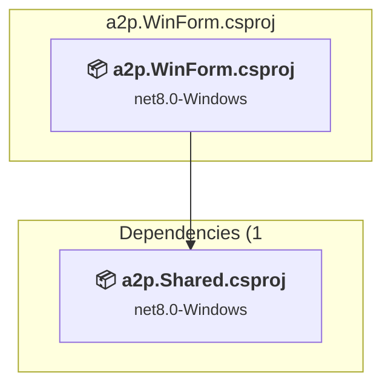

# Projects and dependencies analysis

This document provides a comprehensive overview of the projects and their dependencies in the context of upgrading to .NETCoreApp,Version=v10.0.

## Table of Contents

- [Executive Summary](#executive-Summary)
  - [Highlevel Metrics](#highlevel-metrics)
  - [Projects Compatibility](#projects-compatibility)
  - [Package Compatibility](#package-compatibility)
  - [API Compatibility](#api-compatibility)
  - [Binding Redirect Configuration](#binding-redirect-configuration)
- [Aggregate NuGet packages details](#aggregate-nuget-packages-details)
- [Top API Migration Challenges](#top-api-migration-challenges)
  - [Technologies and Features](#technologies-and-features)
  - [Most Frequent API Issues](#most-frequent-api-issues)
- [Projects Relationship Graph](#projects-relationship-graph)
- [Project Details](#project-details)

  - [build\a2p.Installer\a2p.Installer.wixproj](#builda2pinstallera2pinstallerwixproj)
  - [src\a2p.Shared\a2p.Shared.csproj](#srca2pshareda2psharedcsproj)
  - [src\a2p.WinForm\a2p.WinForm.csproj](#srca2pwinforma2pwinformcsproj)

## Executive Summary

### Highlevel Metrics

| Metric | Count | Status |
| :--- | :---: | :--- |
| Total Projects | 3 | All require upgrade |
| Total NuGet Packages | 84 | 5 need upgrade |
| Total Code Files | 82 |  |
| Total Code Files with Incidents | 17 |  |
| Total Lines of Code | 13887 |  |
| Total Number of Issues | 7738 |  |
| Estimated LOC to modify | 7725+ | at least 55.6% of codebase |

### Projects Compatibility

| Project | Target Framework | Difficulty | Package Issues | API Issues | Binding Issues | Est. LOC Impact | Description |
| :--- | :---: | :---: | :---: | :---: | :---: | :---: | :--- |
| [build\a2p.Installer\a2p.Installer.wixproj](#builda2pinstallera2pinstallerwixproj) | native | 🟢 Low | 0 | 0 | 0 |  | DotNetCoreApp, Sdk Style = True |
| [src\a2p.Shared\a2p.Shared.csproj](#srca2pshareda2psharedcsproj) | net8.0-Windows | 🟢 Low | 5 | 0 | 0 |  | ClassLibrary, Sdk Style = True |
| [src\a2p.WinForm\a2p.WinForm.csproj](#srca2pwinforma2pwinformcsproj) | net8.0-Windows | 🟡 Medium | 5 | 7725 | 0 | 7725+ | WinForms, Sdk Style = True |

### Package Compatibility

| Status | Count | Percentage |
| :--- | :---: | :---: |
| ✅ Compatible | 79 | 94.0% |
| ⚠️ Incompatible | 0 | 0.0% |
| 🔄 Upgrade Recommended | 5 | 6.0% |
| ***Total NuGet Packages*** | ***84*** | ***100%*** |

### API Compatibility

| Category | Count | Impact |
| :--- | :---: | :--- |
| 🔴 Binary Incompatible | 6966 | High - Require code changes |
| 🟡 Source Incompatible | 758 | Medium - Needs re-compilation and potential conflicting API error fixing |
| 🔵 Behavioral change | 1 | Low - Behavioral changes that may require testing at runtime |
| ✅ Compatible | 15555 |  |
| ***Total APIs Analyzed*** | ***23280*** |  |

## Aggregate NuGet packages details

| Package | Current Version | Suggested Version | Projects | Description |
| :--- | :---: | :---: | :--- | :--- |
| Azure.Core | 1.38.0 |  | [a2p.Shared.csproj](#srca2pshareda2psharedcsproj) [a2p.WinForm.csproj](#srca2pwinforma2pwinformcsproj) | ✅Compatible |
| Azure.Identity | 1.11.4 |  | [a2p.Shared.csproj](#srca2pshareda2psharedcsproj) [a2p.WinForm.csproj](#srca2pwinforma2pwinformcsproj) | ✅Compatible |
| ClosedXML | 0.104.2 |  | [a2p.Shared.csproj](#srca2pshareda2psharedcsproj) [a2p.WinForm.csproj](#srca2pwinforma2pwinformcsproj) | ✅Compatible |
| ClosedXML.Parser | 1.2.0 |  | [a2p.Shared.csproj](#srca2pshareda2psharedcsproj) [a2p.WinForm.csproj](#srca2pwinforma2pwinformcsproj) | ✅Compatible |
| DocumentFormat.OpenXml | 3.1.1 |  | [a2p.Shared.csproj](#srca2pshareda2psharedcsproj) [a2p.WinForm.csproj](#srca2pwinforma2pwinformcsproj) | ✅Compatible |
| DocumentFormat.OpenXml.Framework | 3.1.1 |  | [a2p.Shared.csproj](#srca2pshareda2psharedcsproj) [a2p.WinForm.csproj](#srca2pwinforma2pwinformcsproj) | ✅Compatible |
| Eris.Serilog.Formatting.Json | 1.1.0 |  | [a2p.Shared.csproj](#srca2pshareda2psharedcsproj) [a2p.WinForm.csproj](#srca2pwinforma2pwinformcsproj) | ✅Compatible |
| ExcelNumberFormat | 1.1.0 |  | [a2p.Shared.csproj](#srca2pshareda2psharedcsproj) [a2p.WinForm.csproj](#srca2pwinforma2pwinformcsproj) | ✅Compatible |
| MathNet.Numerics | 5.0.0 |  | [a2p.Shared.csproj](#srca2pshareda2psharedcsproj) [a2p.WinForm.csproj](#srca2pwinforma2pwinformcsproj) | ✅Compatible |
| Microsoft.Bcl.AsyncInterfaces | 1.1.1 |  | [a2p.Shared.csproj](#srca2pshareda2psharedcsproj) [a2p.WinForm.csproj](#srca2pwinforma2pwinformcsproj) | ✅Compatible |
| Microsoft.Bcl.Cryptography | 9.0.0 |  | [a2p.Shared.csproj](#srca2pshareda2psharedcsproj) [a2p.WinForm.csproj](#srca2pwinforma2pwinformcsproj) | ✅Compatible |
| Microsoft.Data.SqlClient | 6.0.0-preview3.24332.3 |  | [a2p.Shared.csproj](#srca2pshareda2psharedcsproj) [a2p.WinForm.csproj](#srca2pwinforma2pwinformcsproj) | ✅Compatible |
| Microsoft.Data.SqlClient.SNI.runtime | 6.0.0-preview1.24226.4 |  | [a2p.Shared.csproj](#srca2pshareda2psharedcsproj) [a2p.WinForm.csproj](#srca2pwinforma2pwinformcsproj) | ✅Compatible |
| Microsoft.Extensions.Caching.Abstractions | 10.0.0-preview.2.25163.2 |  | [a2p.Shared.csproj](#srca2pshareda2psharedcsproj) [a2p.WinForm.csproj](#srca2pwinforma2pwinformcsproj) | ✅Compatible |
| Microsoft.Extensions.Caching.Memory | 10.0.0-preview.2.25163.2 | 10.0.12 | [a2p.Shared.csproj](#srca2pshareda2psharedcsproj) [a2p.WinForm.csproj](#srca2pwinforma2pwinformcsproj) | NuGet package upgrade is recommended |
| Microsoft.Extensions.Configuration | 9.0.0 |  | [a2p.Shared.csproj](#srca2pshareda2psharedcsproj) [a2p.WinForm.csproj](#srca2pwinforma2pwinformcsproj) | ✅Compatible |
| Microsoft.Extensions.Configuration.Abstractions | 9.0.0 |  | [a2p.Shared.csproj](#srca2pshareda2psharedcsproj) [a2p.WinForm.csproj](#srca2pwinforma2pwinformcsproj) | ✅Compatible |
| Microsoft.Extensions.Configuration.Binder | 9.0.0 |  | [a2p.Shared.csproj](#srca2pshareda2psharedcsproj) [a2p.WinForm.csproj](#srca2pwinforma2pwinformcsproj) | ✅Compatible |
| Microsoft.Extensions.Configuration.FileExtensions | 9.0.0 | 10.0.12 | [a2p.Shared.csproj](#srca2pshareda2psharedcsproj) [a2p.WinForm.csproj](#srca2pwinforma2pwinformcsproj) | NuGet package upgrade is recommended |
| Microsoft.Extensions.Configuration.Json | 9.0.0 | 10.0.12 | [a2p.Shared.csproj](#srca2pshareda2psharedcsproj) [a2p.WinForm.csproj](#srca2pwinforma2pwinformcsproj) | NuGet package upgrade is recommended |
| Microsoft.Extensions.DependencyInjection | 9.0.0 |  | [a2p.Shared.csproj](#srca2pshareda2psharedcsproj) [a2p.WinForm.csproj](#srca2pwinforma2pwinformcsproj) | ✅Compatible |
| Microsoft.Extensions.DependencyInjection.Abstractions | 10.0.0-preview.2.25163.2 |  | [a2p.Shared.csproj](#srca2pshareda2psharedcsproj) [a2p.WinForm.csproj](#srca2pwinforma2pwinformcsproj) | ✅Compatible |
| Microsoft.Extensions.DependencyModel | 9.0.0 |  | [a2p.Shared.csproj](#srca2pshareda2psharedcsproj) [a2p.WinForm.csproj](#srca2pwinforma2pwinformcsproj) | ✅Compatible |
| Microsoft.Extensions.Diagnostics.Abstractions | 9.0.0 |  | [a2p.Shared.csproj](#srca2pshareda2psharedcsproj) [a2p.WinForm.csproj](#srca2pwinforma2pwinformcsproj) | ✅Compatible |
| Microsoft.Extensions.FileProviders.Abstractions | 9.0.0 |  | [a2p.Shared.csproj](#srca2pshareda2psharedcsproj) [a2p.WinForm.csproj](#srca2pwinforma2pwinformcsproj) | ✅Compatible |
| Microsoft.Extensions.FileProviders.Physical | 9.0.0 |  | [a2p.Shared.csproj](#srca2pshareda2psharedcsproj) [a2p.WinForm.csproj](#srca2pwinforma2pwinformcsproj) | ✅Compatible |
| Microsoft.Extensions.FileSystemGlobbing | 9.0.0 |  | [a2p.Shared.csproj](#srca2pshareda2psharedcsproj) [a2p.WinForm.csproj](#srca2pwinforma2pwinformcsproj) | ✅Compatible |
| Microsoft.Extensions.Hosting.Abstractions | 9.0.0 |  | [a2p.Shared.csproj](#srca2pshareda2psharedcsproj) [a2p.WinForm.csproj](#srca2pwinforma2pwinformcsproj) | ✅Compatible |
| Microsoft.Extensions.Logging | 9.0.0 | 10.0.12 | [a2p.Shared.csproj](#srca2pshareda2psharedcsproj) [a2p.WinForm.csproj](#srca2pwinforma2pwinformcsproj) | NuGet package upgrade is recommended |
| Microsoft.Extensions.Logging.Abstractions | 10.0.0-preview.2.25163.2 |  | [a2p.Shared.csproj](#srca2pshareda2psharedcsproj) [a2p.WinForm.csproj](#srca2pwinforma2pwinformcsproj) | ✅Compatible |
| Microsoft.Extensions.Logging.EventLog | 9.0.0 | 10.0.12 | [a2p.Shared.csproj](#srca2pshareda2psharedcsproj) [a2p.WinForm.csproj](#srca2pwinforma2pwinformcsproj) | NuGet package upgrade is recommended |
| Microsoft.Extensions.Options | 10.0.0-preview.2.25163.2 |  | [a2p.Shared.csproj](#srca2pshareda2psharedcsproj) [a2p.WinForm.csproj](#srca2pwinforma2pwinformcsproj) | ✅Compatible |
| Microsoft.Extensions.Primitives | 10.0.0-preview.2.25163.2 |  | [a2p.Shared.csproj](#srca2pshareda2psharedcsproj) [a2p.WinForm.csproj](#srca2pwinforma2pwinformcsproj) | ✅Compatible |
| Microsoft.Identity.Client | 4.61.3 |  | [a2p.Shared.csproj](#srca2pshareda2psharedcsproj) [a2p.WinForm.csproj](#srca2pwinforma2pwinformcsproj) | ✅Compatible |
| Microsoft.Identity.Client.Extensions.Msal | 4.61.3 |  | [a2p.Shared.csproj](#srca2pshareda2psharedcsproj) [a2p.WinForm.csproj](#srca2pwinforma2pwinformcsproj) | ✅Compatible |
| Microsoft.IdentityModel.Abstractions | 7.5.0 |  | [a2p.Shared.csproj](#srca2pshareda2psharedcsproj) [a2p.WinForm.csproj](#srca2pwinforma2pwinformcsproj) | ✅Compatible |
| Microsoft.IdentityModel.JsonWebTokens | 7.5.0 |  | [a2p.Shared.csproj](#srca2pshareda2psharedcsproj) [a2p.WinForm.csproj](#srca2pwinforma2pwinformcsproj) | ✅Compatible |
| Microsoft.IdentityModel.Logging | 7.5.0 |  | [a2p.Shared.csproj](#srca2pshareda2psharedcsproj) [a2p.WinForm.csproj](#srca2pwinforma2pwinformcsproj) | ✅Compatible |
| Microsoft.IdentityModel.Protocols | 7.5.0 |  | [a2p.Shared.csproj](#srca2pshareda2psharedcsproj) [a2p.WinForm.csproj](#srca2pwinforma2pwinformcsproj) | ✅Compatible |
| Microsoft.IdentityModel.Protocols.OpenIdConnect | 7.5.0 |  | [a2p.Shared.csproj](#srca2pshareda2psharedcsproj) [a2p.WinForm.csproj](#srca2pwinforma2pwinformcsproj) | ✅Compatible |
| Microsoft.IdentityModel.Tokens | 7.5.0 |  | [a2p.Shared.csproj](#srca2pshareda2psharedcsproj) [a2p.WinForm.csproj](#srca2pwinforma2pwinformcsproj) | ✅Compatible |
| Microsoft.SqlServer.Server | 1.0.0 |  | [a2p.Shared.csproj](#srca2pshareda2psharedcsproj) [a2p.WinForm.csproj](#srca2pwinforma2pwinformcsproj) | ✅Compatible |
| Newtonsoft.Json | 13.0.3 |  | [a2p.Shared.csproj](#srca2pshareda2psharedcsproj) [a2p.WinForm.csproj](#srca2pwinforma2pwinformcsproj) | ✅Compatible |
| RBush | 4.0.0 |  | [a2p.Shared.csproj](#srca2pshareda2psharedcsproj) [a2p.WinForm.csproj](#srca2pwinforma2pwinformcsproj) | ✅Compatible |
| Serilog | 4.2.0 |  | [a2p.Shared.csproj](#srca2pshareda2psharedcsproj) [a2p.WinForm.csproj](#srca2pwinforma2pwinformcsproj) | ✅Compatible |
| Serilog.AspNetCore | 9.0.0 |  | [a2p.Shared.csproj](#srca2pshareda2psharedcsproj) [a2p.WinForm.csproj](#srca2pwinforma2pwinformcsproj) | ✅Compatible |
| Serilog.Enrichers.Environment | 3.0.1 |  | [a2p.Shared.csproj](#srca2pshareda2psharedcsproj) [a2p.WinForm.csproj](#srca2pwinforma2pwinformcsproj) | ✅Compatible |
| Serilog.Enrichers.Thread | 4.0.0 |  | [a2p.Shared.csproj](#srca2pshareda2psharedcsproj) [a2p.WinForm.csproj](#srca2pwinforma2pwinformcsproj) | ✅Compatible |
| Serilog.Exceptions | 8.4.0 |  | [a2p.Shared.csproj](#srca2pshareda2psharedcsproj) [a2p.WinForm.csproj](#srca2pwinforma2pwinformcsproj) | ✅Compatible |
| Serilog.Expressions | 5.1.0-dev-00186 |  | [a2p.Shared.csproj](#srca2pshareda2psharedcsproj) [a2p.WinForm.csproj](#srca2pwinforma2pwinformcsproj) | ✅Compatible |
| Serilog.Extensions.Hosting | 9.0.0 |  | [a2p.Shared.csproj](#srca2pshareda2psharedcsproj) [a2p.WinForm.csproj](#srca2pwinforma2pwinformcsproj) | ✅Compatible |
| Serilog.Extensions.Logging | 9.0.1-dev-02308 |  | [a2p.Shared.csproj](#srca2pshareda2psharedcsproj) [a2p.WinForm.csproj](#srca2pwinforma2pwinformcsproj) | ✅Compatible |
| Serilog.Extensions.Logging.File | 9.0.0-dev-02302 |  | [a2p.Shared.csproj](#srca2pshareda2psharedcsproj) [a2p.WinForm.csproj](#srca2pwinforma2pwinformcsproj) | ✅Compatible |
| Serilog.Formatting.Compact | 3.0.0 |  | [a2p.Shared.csproj](#srca2pshareda2psharedcsproj) [a2p.WinForm.csproj](#srca2pwinforma2pwinformcsproj) | ✅Compatible |
| Serilog.Formatting.Compact.Reader | 4.1.0-dev-00085 |  | [a2p.Shared.csproj](#srca2pshareda2psharedcsproj) [a2p.WinForm.csproj](#srca2pwinforma2pwinformcsproj) | ✅Compatible |
| Serilog.Settings.Configuration | 9.0.0 |  | [a2p.Shared.csproj](#srca2pshareda2psharedcsproj) [a2p.WinForm.csproj](#srca2pwinforma2pwinformcsproj) | ✅Compatible |
| Serilog.Sinks.Async | 2.1.0 |  | [a2p.Shared.csproj](#srca2pshareda2psharedcsproj) [a2p.WinForm.csproj](#srca2pwinforma2pwinformcsproj) | ✅Compatible |
| Serilog.Sinks.Console | 6.0.0 |  | [a2p.Shared.csproj](#srca2pshareda2psharedcsproj) [a2p.WinForm.csproj](#srca2pwinforma2pwinformcsproj) | ✅Compatible |
| Serilog.Sinks.Debug | 3.0.0 |  | [a2p.Shared.csproj](#srca2pshareda2psharedcsproj) [a2p.WinForm.csproj](#srca2pwinforma2pwinformcsproj) | ✅Compatible |
| Serilog.Sinks.EventLog | 4.0.1-dev-00087 |  | [a2p.Shared.csproj](#srca2pshareda2psharedcsproj) [a2p.WinForm.csproj](#srca2pwinforma2pwinformcsproj) | ✅Compatible |
| Serilog.Sinks.File | 6.0.0 |  | [a2p.Shared.csproj](#srca2pshareda2psharedcsproj) [a2p.WinForm.csproj](#srca2pwinforma2pwinformcsproj) | ✅Compatible |
| Serilog.Sinks.Seq | 9.0.0 |  | [a2p.Shared.csproj](#srca2pshareda2psharedcsproj) [a2p.WinForm.csproj](#srca2pwinforma2pwinformcsproj) | ✅Compatible |
| SixLabors.Fonts | 1.0.0 |  | [a2p.Shared.csproj](#srca2pshareda2psharedcsproj) [a2p.WinForm.csproj](#srca2pwinforma2pwinformcsproj) | ✅Compatible |
| System.ClientModel | 1.0.0 |  | [a2p.Shared.csproj](#srca2pshareda2psharedcsproj) [a2p.WinForm.csproj](#srca2pwinforma2pwinformcsproj) | ✅Compatible |
| System.Configuration.ConfigurationManager | 9.0.0 |  | [a2p.Shared.csproj](#srca2pshareda2psharedcsproj) [a2p.WinForm.csproj](#srca2pwinforma2pwinformcsproj) | ✅Compatible |
| System.Diagnostics.DiagnosticSource | 10.0.0-preview.2.25163.2 |  | [a2p.Shared.csproj](#srca2pshareda2psharedcsproj) [a2p.WinForm.csproj](#srca2pwinforma2pwinformcsproj) | ✅Compatible |
| System.Diagnostics.EventLog | 9.0.0 |  | [a2p.Shared.csproj](#srca2pshareda2psharedcsproj) [a2p.WinForm.csproj](#srca2pwinforma2pwinformcsproj) | ✅Compatible |
| System.Formats.Asn1 | 9.0.0 |  | [a2p.Shared.csproj](#srca2pshareda2psharedcsproj) [a2p.WinForm.csproj](#srca2pwinforma2pwinformcsproj) | ✅Compatible |
| System.IdentityModel.Tokens.Jwt | 7.5.0 |  | [a2p.Shared.csproj](#srca2pshareda2psharedcsproj) [a2p.WinForm.csproj](#srca2pwinforma2pwinformcsproj) | ✅Compatible |
| System.IO.Packaging | 8.0.1 |  | [a2p.Shared.csproj](#srca2pshareda2psharedcsproj) [a2p.WinForm.csproj](#srca2pwinforma2pwinformcsproj) | ✅Compatible |
| System.IO.Pipelines | 9.0.0 |  | [a2p.Shared.csproj](#srca2pshareda2psharedcsproj) [a2p.WinForm.csproj](#srca2pwinforma2pwinformcsproj) | ✅Compatible |
| System.Memory | 4.5.4 |  | [a2p.Shared.csproj](#srca2pshareda2psharedcsproj) [a2p.WinForm.csproj](#srca2pwinforma2pwinformcsproj) | ✅Compatible |
| System.Memory.Data | 1.0.2 |  | [a2p.Shared.csproj](#srca2pshareda2psharedcsproj) [a2p.WinForm.csproj](#srca2pwinforma2pwinformcsproj) | ✅Compatible |
| System.Numerics.Vectors | 4.5.0 |  | [a2p.Shared.csproj](#srca2pshareda2psharedcsproj) [a2p.WinForm.csproj](#srca2pwinforma2pwinformcsproj) | ✅Compatible |
| System.Reflection.TypeExtensions | 4.7.0 |  | [a2p.Shared.csproj](#srca2pshareda2psharedcsproj) [a2p.WinForm.csproj](#srca2pwinforma2pwinformcsproj) | ✅Compatible |
| System.Security.Cryptography.Pkcs | 9.0.0 |  | [a2p.Shared.csproj](#srca2pshareda2psharedcsproj) [a2p.WinForm.csproj](#srca2pwinforma2pwinformcsproj) | ✅Compatible |
| System.Security.Cryptography.ProtectedData | 9.0.0 |  | [a2p.Shared.csproj](#srca2pshareda2psharedcsproj) [a2p.WinForm.csproj](#srca2pwinforma2pwinformcsproj) | ✅Compatible |
| System.Text.Encodings.Web | 9.0.0 |  | [a2p.Shared.csproj](#srca2pshareda2psharedcsproj) [a2p.WinForm.csproj](#srca2pwinforma2pwinformcsproj) | ✅Compatible |
| System.Text.Json | 9.0.0 |  | [a2p.Shared.csproj](#srca2pshareda2psharedcsproj) [a2p.WinForm.csproj](#srca2pwinforma2pwinformcsproj) | ✅Compatible |
| System.Threading.Tasks.Extensions | 4.5.4 |  | [a2p.Shared.csproj](#srca2pshareda2psharedcsproj) [a2p.WinForm.csproj](#srca2pwinforma2pwinformcsproj) | ✅Compatible |
| WixToolset.Netfx.wixext | 5.0.2 |  | [a2p.Installer.wixproj](#builda2pinstallera2pinstallerwixproj) | ✅Compatible |
| WixToolset.Sql.wixext | 5.0.2 |  | [a2p.Installer.wixproj](#builda2pinstallera2pinstallerwixproj) | ✅Compatible |
| WixToolset.UI.wixext | 5.0.2 |  | [a2p.Installer.wixproj](#builda2pinstallera2pinstallerwixproj) | ✅Compatible |
| WixToolset.Util.wixext | 5.0.2 |  | [a2p.Installer.wixproj](#builda2pinstallera2pinstallerwixproj) | ✅Compatible |

## Top API Migration Challenges

### Technologies and Features

| Technology | Issues | Percentage | Migration Path |
| :--- | :---: | :---: | :--- |
| Windows Forms | 6966 | 90.2% | Windows Forms APIs for building Windows desktop applications with traditional Forms-based UI that are available in .NET on Windows. Enable Windows Desktop support: Option 1 (Recommended): Target net9.0-windows; Option 2: Add <UseWindowsDesktop>true</UseWindowsDesktop>; Option 3 (Legacy): Use Microsoft.NET.Sdk.WindowsDesktop SDK. |
| Windows Forms Legacy Controls | 1413 | 18.3% | Legacy Windows Forms controls that have been removed from .NET Core/5+ including StatusBar, DataGrid, ContextMenu, MainMenu, MenuItem, and ToolBar. These controls were replaced by more modern alternatives. Use ToolStrip, MenuStrip, ContextMenuStrip, and DataGridView instead. |
| GDI+ / System.Drawing | 758 | 9.8% | System.Drawing APIs for 2D graphics, imaging, and printing that are available via NuGet package System.Drawing.Common. Note: Not recommended for server scenarios due to Windows dependencies; consider cross-platform alternatives like SkiaSharp or ImageSharp for new code. |

### Most Frequent API Issues

| API | Count | Percentage | Category |
| :--- | :---: | :---: | :--- |
| T:System.Windows.Forms.Label | 728 | 9.4% | Binary Incompatible |
| T:System.Windows.Forms.TableLayoutPanel | 214 | 2.8% | Binary Incompatible |
| T:System.Windows.Forms.Button | 213 | 2.8% | Binary Incompatible |
| T:System.Windows.Forms.Panel | 210 | 2.7% | Binary Incompatible |
| T:System.Windows.Forms.DockStyle | 198 | 2.6% | Binary Incompatible |
| T:System.Windows.Forms.DataGridView | 184 | 2.4% | Binary Incompatible |
| T:System.Windows.Forms.Padding | 182 | 2.4% | Binary Incompatible |
| T:System.Drawing.ContentAlignment | 180 | 2.3% | Source Incompatible |
| T:System.Drawing.Font | 148 | 1.9% | Source Incompatible |
| T:System.Windows.Forms.TextBox | 127 | 1.6% | Binary Incompatible |
| T:System.Drawing.FontStyle | 110 | 1.4% | Source Incompatible |
| T:System.Windows.Forms.FlatStyle | 102 | 1.3% | Binary Incompatible |
| P:System.Windows.Forms.Control.Name | 92 | 1.2% | Binary Incompatible |
| T:System.Windows.Forms.SizeType | 90 | 1.2% | Binary Incompatible |
| T:System.Windows.Forms.AnchorStyles | 89 | 1.2% | Binary Incompatible |
| P:System.Windows.Forms.Control.Size | 85 | 1.1% | Binary Incompatible |
| P:System.Windows.Forms.Control.TabIndex | 81 | 1.0% | Binary Incompatible |
| P:System.Windows.Forms.Control.Location | 81 | 1.0% | Binary Incompatible |
| T:System.Windows.Forms.CheckBox | 73 | 0.9% | Binary Incompatible |
| P:System.Windows.Forms.Control.Margin | 69 | 0.9% | Binary Incompatible |
| P:System.Windows.Forms.Control.ForeColor | 68 | 0.9% | Binary Incompatible |
| P:System.Windows.Forms.Label.Text | 68 | 0.9% | Binary Incompatible |
| M:System.Windows.Forms.Padding.#ctor(System.Int32) | 67 | 0.9% | Binary Incompatible |
| T:System.Windows.Forms.DataGridViewAutoSizeColumnMode | 66 | 0.9% | Binary Incompatible |
| P:System.Windows.Forms.Control.Dock | 65 | 0.8% | Binary Incompatible |
| T:System.Windows.Forms.DataGridViewColumnCollection | 63 | 0.8% | Binary Incompatible |
| P:System.Windows.Forms.DataGridView.Columns | 63 | 0.8% | Binary Incompatible |
| F:System.Drawing.FontStyle.Bold | 55 | 0.7% | Source Incompatible |
| M:System.Windows.Forms.Control.ResumeLayout(System.Boolean) | 53 | 0.7% | Binary Incompatible |
| P:System.Windows.Forms.Control.Font | 53 | 0.7% | Binary Incompatible |
| T:System.Windows.Forms.ToolStripStatusLabel | 53 | 0.7% | Binary Incompatible |
| T:System.Windows.Forms.TableLayoutControlCollection | 51 | 0.7% | Binary Incompatible |
| P:System.Windows.Forms.TableLayoutPanel.Controls | 51 | 0.7% | Binary Incompatible |
| M:System.Windows.Forms.TableLayoutControlCollection.Add(System.Windows.Forms.Control,System.Int32,System.Int32) | 51 | 0.7% | Binary Incompatible |
| T:System.Windows.Forms.DataGridViewCellStyle | 47 | 0.6% | Binary Incompatible |
| T:System.Drawing.Bitmap | 45 | 0.6% | Source Incompatible |
| F:System.Windows.Forms.DockStyle.Fill | 44 | 0.6% | Binary Incompatible |
| T:System.Windows.Forms.AutoScaleMode | 42 | 0.5% | Binary Incompatible |
| M:System.Windows.Forms.Control.PerformLayout | 41 | 0.5% | Binary Incompatible |
| M:System.Windows.Forms.Label.#ctor | 41 | 0.5% | Binary Incompatible |
| M:System.Drawing.Font.#ctor(System.String,System.Single,System.Drawing.FontStyle) | 40 | 0.5% | Source Incompatible |
| P:System.Windows.Forms.Label.TextAlign | 38 | 0.5% | Binary Incompatible |
| F:System.Windows.Forms.SizeType.Absolute | 38 | 0.5% | Binary Incompatible |
| T:System.Windows.Forms.DataGridViewRowCollection | 38 | 0.5% | Binary Incompatible |
| P:System.Windows.Forms.DataGridView.Rows | 38 | 0.5% | Binary Incompatible |
| T:System.Windows.Forms.StatusStrip | 38 | 0.5% | Binary Incompatible |
| P:System.Windows.Forms.Control.BackColor | 36 | 0.5% | Binary Incompatible |
| M:System.Windows.Forms.Control.SuspendLayout | 34 | 0.4% | Binary Incompatible |
| F:System.Windows.Forms.FlatStyle.Flat | 34 | 0.4% | Binary Incompatible |
| T:System.Windows.Forms.RowStyle | 34 | 0.4% | Binary Incompatible |

## Projects Relationship Graph

Legend:
📦 SDK-style project
⚙️ Classic project

## Project Details

### build\a2p.Installer\a2p.Installer.wixproj

#### Project Info

- **Current Target Framework:** native
- **Proposed Target Framework:** net10.0
- **SDK-style**: True
- **Project Kind:** DotNetCoreApp
- **Dependencies**: 0
- **Dependants**: 0
- **Number of Files**: 3
- **Number of Files with Incidents**: 1
- **Lines of Code**: 497
- **Estimated LOC to modify**: 0+ (at least 0.0% of the project)

#### Dependency Graph

Legend:
📦 SDK-style project
⚙️ Classic project

### API Compatibility

| Category | Count | Impact |
| :--- | :---: | :--- |
| 🔴 Binary Incompatible | 0 | High - Require code changes |
| 🟡 Source Incompatible | 0 | Medium - Needs re-compilation and potential conflicting API error fixing |
| 🔵 Behavioral change | 0 | Low - Behavioral changes that may require testing at runtime |
| ✅ Compatible | 0 |  |
| ***Total APIs Analyzed*** | ***0*** |  |

### src\a2p.Shared\a2p.Shared.csproj

#### Project Info

- **Current Target Framework:** net8.0-Windows
- **Proposed Target Framework:** net10.0--Windows
- **SDK-style**: True
- **Project Kind:** ClassLibrary
- **Dependencies**: 0
- **Dependants**: 1
- **Number of Files**: 65
- **Number of Files with Incidents**: 1
- **Lines of Code**: 7687
- **Estimated LOC to modify**: 0+ (at least 0.0% of the project)

#### Dependency Graph

Legend:
📦 SDK-style project
⚙️ Classic project

### API Compatibility

| Category | Count | Impact |
| :--- | :---: | :--- |
| 🔴 Binary Incompatible | 0 | High - Require code changes |
| 🟡 Source Incompatible | 0 | Medium - Needs re-compilation and potential conflicting API error fixing |
| 🔵 Behavioral change | 0 | Low - Behavioral changes that may require testing at runtime |
| ✅ Compatible | 10469 |  |
| ***Total APIs Analyzed*** | ***10469*** |  |

### src\a2p.WinForm\a2p.WinForm.csproj

#### Project Info

- **Current Target Framework:** net8.0-Windows
- **Proposed Target Framework:** net10.0-windows
- **SDK-style**: True
- **Project Kind:** WinForms
- **Dependencies**: 1
- **Dependants**: 0
- **Number of Files**: 22
- **Number of Files with Incidents**: 15
- **Lines of Code**: 5703
- **Estimated LOC to modify**: 7725+ (at least 135.5% of the project)

#### Dependency Graph

Legend:
📦 SDK-style project
⚙️ Classic project

### API Compatibility

| Category | Count | Impact |
| :--- | :---: | :--- |
| 🔴 Binary Incompatible | 6966 | High - Require code changes |
| 🟡 Source Incompatible | 758 | Medium - Needs re-compilation and potential conflicting API error fixing |
| 🔵 Behavioral change | 1 | Low - Behavioral changes that may require testing at runtime |
| ✅ Compatible | 5086 |  |
| ***Total APIs Analyzed*** | ***12811*** |  |

#### Project Technologies and Features

| Technology | Issues | Percentage | Migration Path |
| :--- | :---: | :---: | :--- |
| Windows Forms Legacy Controls | 1413 | 18.3% | Legacy Windows Forms controls that have been removed from .NET Core/5+ including StatusBar, DataGrid, ContextMenu, MainMenu, MenuItem, and ToolBar. These controls were replaced by more modern alternatives. Use ToolStrip, MenuStrip, ContextMenuStrip, and DataGridView instead. |
| GDI+ / System.Drawing | 758 | 9.8% | System.Drawing APIs for 2D graphics, imaging, and printing that are available via NuGet package System.Drawing.Common. Note: Not recommended for server scenarios due to Windows dependencies; consider cross-platform alternatives like SkiaSharp or ImageSharp for new code. |
| Windows Forms | 6966 | 90.2% | Windows Forms APIs for building Windows desktop applications with traditional Forms-based UI that are available in .NET on Windows. Enable Windows Desktop support: Option 1 (Recommended): Target net9.0-windows; Option 2: Add <UseWindowsDesktop>true</UseWindowsDesktop>; Option 3 (Legacy): Use Microsoft.NET.Sdk.WindowsDesktop SDK. |

